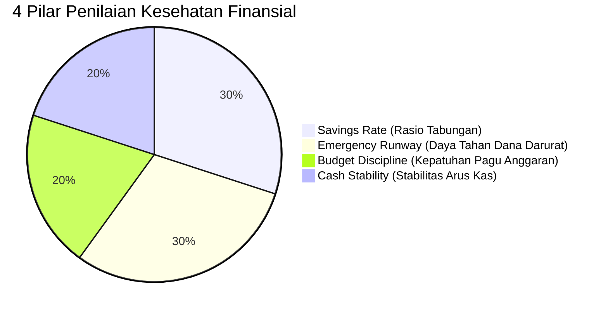
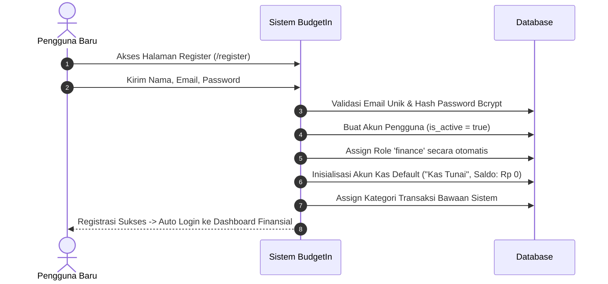
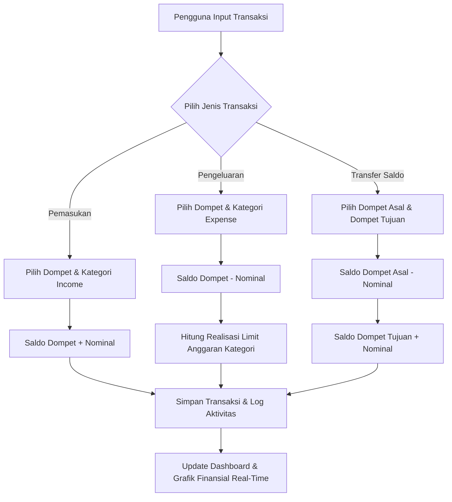
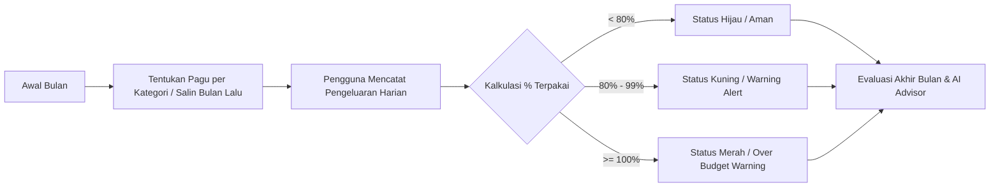
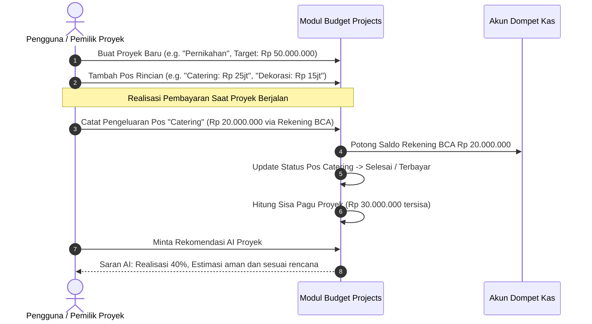
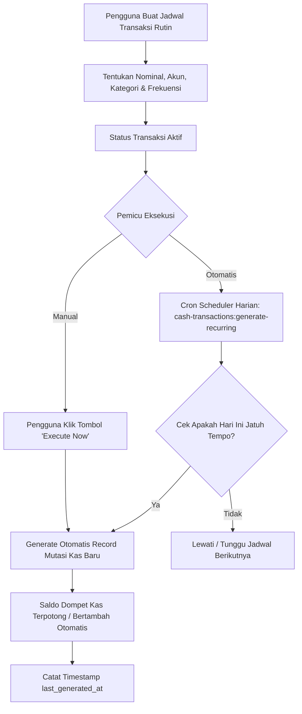
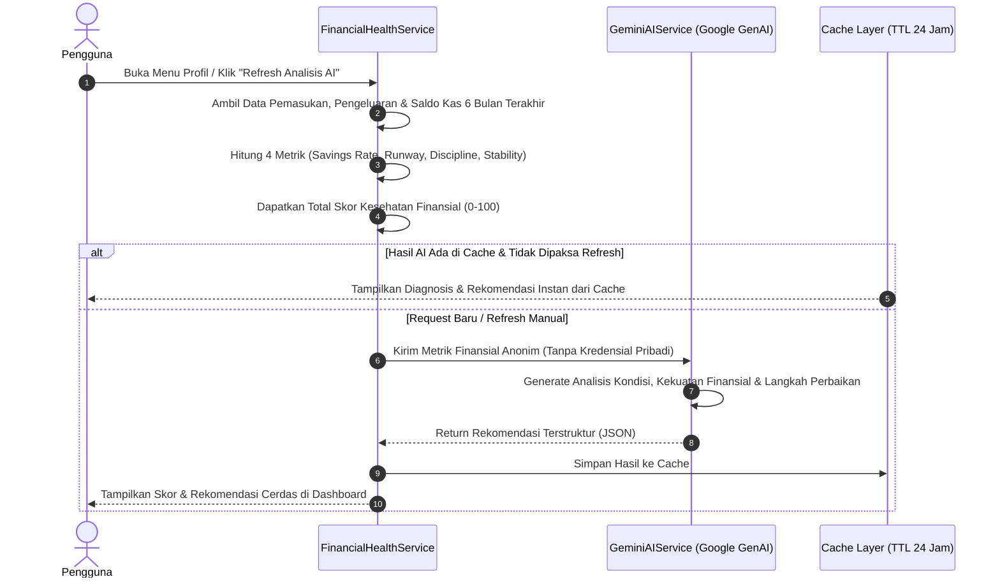

# 📘 Panduan Lengkap Fitur & Alur Kerja Aplikasi BudgetIn

Dokumen ini berisi dokumentasi komprehensif mengenai seluruh modul, fitur unggulan, arsitektur data, alur kerja (*workflows*), dan diagram sistem dari aplikasi **BudgetIn** (*Smart Financial & Multi-Wallet Cashflow Management Platform*).

---

## 📑 Daftar Isi
1. [Ringkasan & Filosofi Produk](#1-ringkasan--filosofi-produk)
2. [Matriks Fitur Utama Aplikasi](#2-matriks-fitur-utama-aplikasi)
   - [2.1 Multi-Wallet & Manajemen Rekening Kas](#21-multi-wallet--manajemen-rekening-kas)
   - [2.2 Pencatatan Arus Kas & Transfer Antar-Dompet](#22-pencatatan-arus-kas--transfer-antar-dompet)
   - [2.3 Perencanaan Pagu Anggaran Bulanan (Category Budgets)](#23-perencanaan-pagu-anggaran-bulanan-category-budgets)
   - [2.4 Anggaran Proyek Khusus & Rencana Acara (Budget Projects)](#24-anggaran-proyek-khusus--rencana-acara-budget-projects)
   - [2.5 Transaksi Berulang & Rutin Otomatis (Recurring Transactions)](#25-transaksi-berulang--rutin-otomatis-recurring-transactions)
   - [2.6 AI Financial Health Advisor (Powered by Gemini AI)](#26-ai-financial-health-advisor-powered-by-gemini-ai)
   - [2.7 Visual Analytics & Ekspor Laporan Keuangan](#27-visual-analytics--ekspor-laporan-keuangan)
   - [2.8 Administrasi, RBAC & Audit Trail](#28-administrasi-rbac--audit-trail)
3. [Diagram Alur Kerja Sistem (System Workflows)](#3-diagram-alur-kerja-sistem-system-workflows)
   - [3.1 Alur Registrasi & Onboarding Tenant Baru](#31-alur-registrasi--onboarding-tenant-baru)
   - [3.2 Alur Transaksi Kas & Mutasi Saldo Real-Time](#32-alur-transaksi-kas--mutasi-saldo-real-time)
   - [3.3 Alur Siklus Pagu Anggaran Bulanan](#33-alur-siklus-pagu-anggaran-bulanan)
   - [3.4 Alur Manajemen Anggaran Proyek & Event](#34-alur-manajemen-anggaran-proyek--event)
   - [3.5 Alur Otomasi Transaksi Berulang (Scheduler)](#35-alur-otomasi-transaksi-berulang-scheduler)
   - [3.6 Alur Konsultasi Kesehatan Finansial AI](#36-alur-konsultasi-kesehatan-finansial-ai)
4. [Struktur Hak Akses & Model Peran (RBAC)](#4-struktur-hak-akses--model-peran-rbac)
5. [Panduan Navigasi Menu & Rute Aplikasi](#5-panduan-navigasi-menu--rute-aplikasi)

---

## 1. Ringkasan & Filosofi Produk

**BudgetIn** adalah platform manajemen arus kas (*cashflow*) dan penganggaran (*budgeting*) modern yang dirancang untuk kebutuhan finansial personal maupun bisnis mandiri (UMKM/Freelancer).

### 🎯 Nilai Utama Produk:
- **Multi-Wallet Flexibility**: Mengelola berbagai kantong keuangan (Bank, Uang Tunai, E-Wallet, Kartu Kredit, Investasi) dalam satu kesatuan dashboard.
- **Strict Multi-Tenant Logical Isolation**: Seluruh data transaksi, rekening, anggaran, dan proyek terisolasi secara mutlak untuk masing-masing pengguna terdaftar.
- **Actionable AI Insights**: Menggunakan Google Gemini AI untuk memberikan diagnosis kesehatan finansial dan rekomendasi langkah perbaikan arus kas yang konkret.
- **Real-Time Financial Control**: Memantau pagu anggaran dan peringatan pengeluaran berlebih (*over-budget warning*) secara instan.

---

## 2. Matriks Fitur Utama Aplikasi

### 2.1 Multi-Wallet & Manajemen Rekening Kas
- **Katalog Tipe Dompet**: Mendukung akun Bank, Kas Tunai, E-Wallet (GoPay, OVO, ShopeePay, DANA), Tabungan/Investasi, dan Tipe Kustom.
- **Custom Account Types**: Pengguna dapat menambahkan tipe rekening baru sesuai kebutuhan pribadi dengan ikon dan warna kustom.
- **Saldo Awal & Perhitungan Saldo Dinamis**: Saldo akhir tiap akun dihitung secara presisi:
  $$\text{Saldo Akhir} = \text{Saldo Awal} + \sum \text{Pemasukan} - \sum \text{Pengeluaran} + \sum \text{Transfer Masuk} - \sum \text{Transfer Keluar}$$
- **Proteksi Tipe Sistem**: Tipe akun bawaan sistem (`is_system = true`) dilindungi dari penghapusan tidak disengaja.

---

### 2.2 Pencatatan Arus Kas & Transfer Antar-Dompet
- **3 Mode Transaksi**:
  1. **Pemasukan (*Income*)**: Menambah saldo dompet sumber.
  2. **Pengeluaran (*Expense*)**: Mengurangi saldo dompet sumber dan menghitung realisasi limit budget kategori.
  3. **Transfer Dana (*Transfer*)**: Memindahkan dana dari dompet A ke dompet B secara simultan dalam satu aksi mutasi.
- **Upload Bukti Pembayaran (*Proof of Transaction*)**: Mendukung lampiran gambar (JPG, PNG, WebP) dan dokumen PDF dengan kompresi otomatis.
- **Pencarian & Filter Multidimensi**: Filter transaksi berdasarkan rentang tanggal, periode preset (Bulan ini, Bulan lalu, Tahun ini, Semua), tipe transaksi, kategori, atau akun kas.

---

### 2.3 Perencanaan Pagu Anggaran Bulanan (Category Budgets)
- **Target Limit per Kategori**: Menentukan batas maksimal pengeluaran untuk setiap pos belanja (misal: *Makanan & Minuman*, *Transportasi*, *Hiburan*).
- **Indikator Progres Interaktif**:
  - 🟢 **Aman (*Safe*)**: Pengeluaran $< 80\%$ dari pagu.
  - 🟡 **Peringatan (*Warning*)**: Pengeluaran $80\% - 99.9\%$ dari pagu.
  - 🔴 **Melebihi Anggaran (*Over Budget*)**: Pengeluaran $\ge 100\%$ dari pagu.
- **Batch Update Anggaran**: Memperbarui pagu banyak kategori sekaligus dalam satu formulir cepat.
- **Salin Anggaran Bulan Sebelumnya**: Fitur satu klik untuk menyalin pagu anggaran dari bulan lalu ke bulan berjalan.

---

### 2.4 Anggaran Proyek Khusus & Rencana Acara (Budget Projects)
- **Alokasi Dana Khusus**: Mengisolasi anggaran untuk tujuan tertentu di luar pengeluaran rutin bulanan (contoh: *Pernikahan*, *Liburan Akhir Tahun*, *Renovasi Rumah*, *Qurban/Hari Raya*).
- **Rincian Pos Anggaran (*Project Items*)**: Memecah proyek ke pos belanja mendalam dengan estimasi pagu masing-masing.
- **Pencatatan Realisasi Transaksi Langsung**: Setiap pengeluaran proyek dapat langsung ditautkan ke akun dompet kas riil, otomatis memotong saldo rekening terkait dan mengupdate sisa pagu proyek.
- **AI Project Financial Advisor**: Analisis estimasi pembengkakan biaya proyek dan rekomendasi penghematan pos anggaran via Gemini AI.

---

### 2.5 Transaksi Berulang & Rutin Otomatis (Recurring Transactions)
- **Frekuensi Terjadwal**: Mendukung transaksi harian (*daily*), mingguan (*weekly*), bulanan (*monthly*), dan tahunan (*yearly*).
- **Contoh Penggunaan**: Gaji bulanan, langganan Netflix/Spotify, tagihan listrik PLN, BPJS, sewa kontrakan/kantor.
- **Artisan Background Scheduler**: Perintah `php artisan cash-transactions:generate-recurring` yang dieksekusi berkala untuk mencatat transaksi yang telah jatuh tempo secara otomatis.
- **Eksekusi Manual Instan (*Execute Now*)**: Memungkinkan pengguna mencatatkan transaksi rutin lebih awal hanya dengan satu klik.

---

### 2.6 AI Financial Health Advisor (Powered by Gemini AI)
Menghitung skor kesehatan keuangan (skala 0 - 100) berdasarkan 4 pilar metrik objektif:



1. **Savings Rate ($30\%$)**: Persentase sisa surplus dari total pemasukan ($\text{Surplus} / \text{Pemasukan} \times 100\%$).
2. **Emergency Runway ($30\%$)**: Ketahanan saldo kas likuid terhadap rata-rata pengeluaran bulanan ($\text{Saldo Kas} / \text{Rata-rata Pengeluaran Bulanan}$).
3. **Budget Discipline ($20\%$)**: Tingkat kedisiplinan menjaga pengeluaran di bawah limit pagu anggaran.
4. **Cash Stability ($20\%$)**: Konsistensi surplus arus kas dari waktu ke waktu.
- **Rekomendasi Aksi Nyata**: Google Gemini AI memberikan ringkasan status (*Healthy*, *Moderate*, *At Risk*), poin positif keuangan Anda, serta tindakan perbaikan prioritas.

---

### 2.7 Visual Analytics & Ekspor Laporan Keuangan
- **Grafik Interaktif Arus Kas**: Visualisasi perbandingan pemasukan vs pengeluaran dan tren harian menggunakan ApexCharts.
- **Breakdown Kategori**: Grafik donat komposisi pengeluaran per pos belanja.
- **Ekspor Spreadsheet Excel (`.xlsx`)**: Ekspor data laporan keuangan siap cetak dan analisis dengan sanitasi keamanan formula injection OWASP.

---

### 2.8 Administrasi, RBAC & Audit Trail
- **Manajemen Pengguna Finance**: Super Admin dapat melihat daftar seluruh tenant, mengaktifkan/menonaktifkan akun tenant secara instan.
- **Role-Based Access Control (RBAC)**: Pemisahan tegas antara hak akses Super Admin dan User Finance via Spatie Laravel-Permission.
- **Activity Logs**: Pencatatan audit trail untuk seluruh aksi CRUD, perubahan konfigurasi, login, dan aktivitas penting sistem.
- **Laravel Log Viewer**: Pemantau file log sistem langsung dari antarmuka web dengan filter level PSR-3 (Error, Warning, Info).

---

## 3. Diagram Alur Kerja Sistem (System Workflows)

### 3.1 Alur Registrasi & Onboarding Tenant Baru



---

### 3.2 Alur Transaksi Kas & Mutasi Saldo Real-Time



---

### 3.3 Alur Siklus Pagu Anggaran Bulanan



---

### 3.4 Alur Manajemen Anggaran Proyek & Event



---

### 3.5 Alur Otomasi Transaksi Berulang (Scheduler)



---

### 3.6 Alur Konsultasi Kesehatan Finansial AI



---

## 4. Struktur Hak Akses & Model Peran (RBAC)

Aplikasi BudgetIn membagi hak akses ke dalam 2 peran utama:

| Modul / Fitur | User Finance (Tenant) | Super Admin |
| :--- | :---: | :---: |
| **Dashboard Finansial Pribadi** | ✅ Akses Penuh | ✅ Akses Penuh |
| **Kelola Dompet Kas Pribadi (CRUD)** | ✅ Akses Penuh | ✅ Akses Penuh |
| **Kelola Kategori Kustom Pribadi** | ✅ Akses Penuh | ✅ Akses Penuh |
| **Transaksi & Mutasi Kas Pribadi** | ✅ Akses Penuh | ✅ Akses Penuh |
| **Pagu Anggaran Kategori Pribadi** | ✅ Akses Penuh | ✅ Akses Penuh |
| **Anggaran Proyek & AI Advisor** | ✅ Akses Penuh | ✅ Akses Penuh |
| **Jadwal Transaksi Berulang** | ✅ Akses Penuh | ✅ Akses Penuh |
| **Ekspor Laporan Keuangan Pribadi** | ✅ Akses Penuh | ✅ Akses Penuh |
| **Konsultasi AI Financial Health** | ✅ Akses Penuh | ✅ Akses Penuh |
| **Kelola Pengguna Finance (Aktif/Nonaktif)** | ❌ Ditolak (403) | ✅ Akses Penuh |
| **Kelola Administrator Sistem** | ❌ Ditolak (403) | ✅ Akses Penuh |
| **Kelola Roles & Permissions RBAC** | ❌ Ditolak (403) | ✅ Akses Penuh |
| **Audit Activity Logs Sistem** | ❌ Ditolak (403) | ✅ Akses Penuh |
| **System Laravel Log Viewer** | ❌ Ditolak (403) | ✅ Akses Penuh |
| **Pengaturan Global Aplikasi (Settings)** | ❌ Ditolak (403) | ✅ Akses Penuh |

---

## 5. Panduan Navigasi Menu & Rute Aplikasi

```text
/ (Landing Page Publik)
├── /login (Halaman Masuk)
├── /register (Halaman Pendaftaran Akun Finance Baru)
└── /admin (Dashboard Area - Wajib Login)
    ├── /admin/dashboard                -> Dashboard Utama & Visual Chart
    ├── /admin/cash_accounts            -> Kelola Rekening & Dompet Kas
    ├── /admin/cash_transactions        -> Mutasi Arus Kas & Ekspor Data
    ├── /admin/category_budgets         -> Limit & Pagu Anggaran Bulanan
    ├── /admin/budget_projects          -> Anggaran Proyek Khusus & Event
    ├── /admin/recurring_transactions   -> Jadwal Transaksi Rutin
    ├── /admin/transaction_categories   -> Kategori Pemasukan & Pengeluaran
    ├── /admin/profile                  -> Profil Akun & Skor Kesehatan Finansial AI
    │
    └── [Menu Khusus Super Admin]
        ├── /admin/finance_users        -> Manajemen Akun Pengguna Finance
        ├── /admin/users                -> Manajemen Administrator Sistem
        ├── /admin/roles                -> Manajemen Peran & Hak Akses
        ├── /admin/permissions          -> Manajemen Izin Akses Granular
        ├── /admin/activity-logs        -> Jejak Audit Aktivitas Pengguna
        ├── /admin/laravel-logs         -> Pemantau Log Error & Warning Sistem
        └── /admin/settings             -> Konfigurasi Nama & Logo Aplikasi
```

---

> 💡 **Informasi Tambahan**:
> - Dokumen Teknis Keamanan & Pengujian Penetrasi: [**`PENTEST_FLOW_GUIDE.md`**](PENTEST_FLOW_GUIDE.md)
> - Laporan Hasil Remediasi Kerentanan Keamanan: [**`PENTEST_REMEDIATION_REPORT.md`**](PENTEST_REMEDIATION_REPORT.md)
